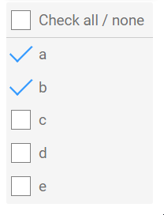

# Check All / None CheckBoxList Checkbox <!-- omit in toc -->

Add a "Check All / None" checkbox to a *CheckBoxList* control. 



# Version
Initial 1.0

1.0.1 Upgraded readme to 6.12+; Converted px to rem

# Setup

## Application Setup
1. Check the *Enable Style Sheet* checkbox in the application properties

## Global Script
1. Create a Global Script called "CheckAllNoneCheckbox"
2. Add the input parameters below to the Global Script
   1. CheckBoxListClass
3. Drag a *JavaScript* action into the script
4. Add the Javascript below unchanged into the JavaScript code property
```javascript
/* Stadium Script https://github.com/stadium-software/checkboxlist-check-all-none */
let scope = this;
let checkBoxListContainerClass = ~.Parameters.Input.CheckBoxListClass;
let checkBoxListContainer = document.querySelectorAll(".check-box-list-container." + checkBoxListContainerClass);
if (checkBoxListContainer.length > 1) {
    console.error("The class '" + checkBoxListContainerClass + "' can only be assigned to one CheckBoxList control");
    return false;
} else if (checkBoxListContainer.length == 0) {
    console.error("The class '" + checkBoxListContainerClass + "' is not assigned to any CheckBoxList control");
    return false;
}
checkBoxListContainer = checkBoxListContainer[0];

let allNoneCheckBoxContainer = document.createElement("div");
allNoneCheckBoxContainer.classList.add("checkbox", "stadium-all-none-checkbox");
let allNoneCheckBox = document.createElement("input");
allNoneCheckBox.type = "checkbox";
allNoneCheckBoxContainer.appendChild(allNoneCheckBox);
let allNoneCheckBoxLabel = document.createElement("label");
let checkBoxID = checkBoxListContainer.id + "_SelectAllNone";
allNoneCheckBox.id = checkBoxID;
allNoneCheckBoxLabel.setAttribute("for",checkBoxID);
allNoneCheckBoxLabel.textContent = "Check all / none";
allNoneCheckBoxContainer.appendChild(allNoneCheckBoxLabel);
document.querySelector("." + checkBoxListContainerClass + " > div").prepend(allNoneCheckBoxContainer);
allNoneCheckBox.addEventListener("change",checkUncheck);

function checkUncheck() {
    if (allNoneCheckBox.checked) {
        let allCheckedBoxValues = getDMValues(checkBoxListContainer, "Options").map(a => a.value);
        setDMValues(checkBoxListContainer, "SelectedValues", allCheckedBoxValues);
    } else {
        setDMValues(checkBoxListContainer, "SelectedValues", []);
    }
}
let getObjectName = (obj) => {
    let objname = obj.id.replace("-container","");
    do {
        let arrNameParts = objname.split(/_(.*)/s);
        objname = arrNameParts[1];
    } while ((objname.match(/_/g) || []).length > 0 && !scope[`${objname}Classes`]);
    return objname;
};
function getDMValues(ob, property) {
    let obname = getObjectName(ob);
    return scope[`${obname}${property}`];
}
function setDMValues(ob, property, value) {
    let obname = getObjectName(ob);
    scope[`${obname}${property}`] = value;
}
```

## Page
1. Drag a *CheckBoxList* control to a page
2. Add a unique classname to the *CheckBoxList* classes property (e.g. check-all-none)

## Page.Load
1. Drag the "CheckAllNoneCheckbox" script to the Page.Load event handler
2. Pass the unique classname into the script "CheckBoxListClass" parameter (e.g. check-all-none)

## CSS
The CSS below is required for the correct functioning of the module. Variables exposed in the [*css-file-variables.css*](css-file-variables.css) file can be [customised](#customising-css).

### Before v6.12
1. Create a folder called "CSS" inside of your Embedded Files in your application
2. Drag the two CSS files from this repo [*css-file-variables.css*](css-file-variables.css) and [*css-file.css*](css-file.css) into that folder
3. Paste the link tags below into the *head* property of your application
```html
<link rel="stylesheet" href="{EmbeddedFiles}/CSS/css-file.css">
<link rel="stylesheet" href="{EmbeddedFiles}/CSS/css-file-variables.css">
``` 

### v6.12+
1. Create a folder called "CSS" inside of your Embedded Files in your application
2. Drag the CSS files from this repo [*css-file.css*](css-file.css) into that folder
3. Paste the link tag below into the *head* property of your application
```html
<link rel="stylesheet" href="{EmbeddedFiles}/CSS/css-file.css">
``` 

### Customising CSS
1. Open the CSS file called [*css-file-variables.css*](css-file-variables.css) from this repo
2. Adjust the variables in the *:root* element as you see fit
3. Stadium 6.12+ users can comment out any variable they do **not** want to customise
4. Add the [*css-file-variables.css*](css-file-variables.css) to the "CSS" folder in the EmbeddedFiles (overwrite)
5. Paste the link tag below into the *head* property of your application (if you don't already have it there)
```html
<link rel="stylesheet" href="{EmbeddedFiles}/CSS/css-file-variables.css">
``` 
6. Add the file to the "CSS" inside of your Embedded Files in your application

**NOTE: Do not change any of the CSS in the 'css-file.css' file**

## Upgrading Stadium Repos
Stadium Repos are not static. They change as additional features are added and bugs are fixed. Using the right method to work with Stadium Repos allows for upgrading them in a controlled manner. 

How to use and update application repos is described here: [Working with Stadium Repos](https://github.com/stadium-software/samples-upgrading)